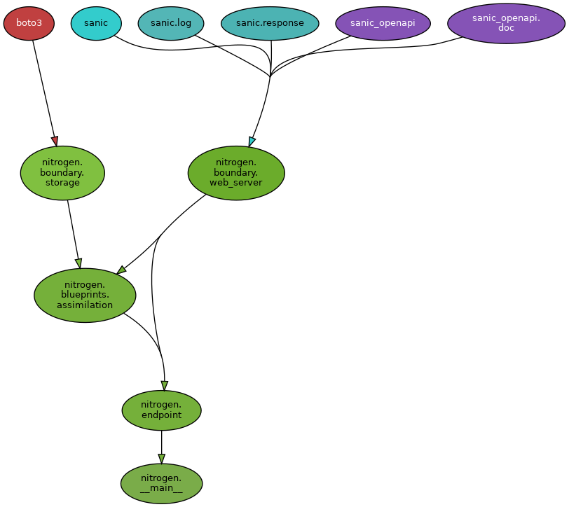

# Dependencies

Dependencies graph (open in a new tab for the full resolution)



This graph is generated using [`pydeps`](https://github.com/thebjorn/pydeps). It does NOT auto update, as it takes few seconds to generate. To update it you can run a command

```sh
docker-compose exec docs pydeps \
-T png \
-o docs/_static/deps.png \
-xx nitrogen.boundary nitrogen.assimilation nitrogen.blueprints \
--no-show nitrogen
```
